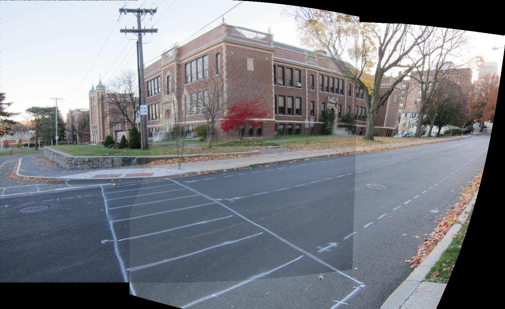
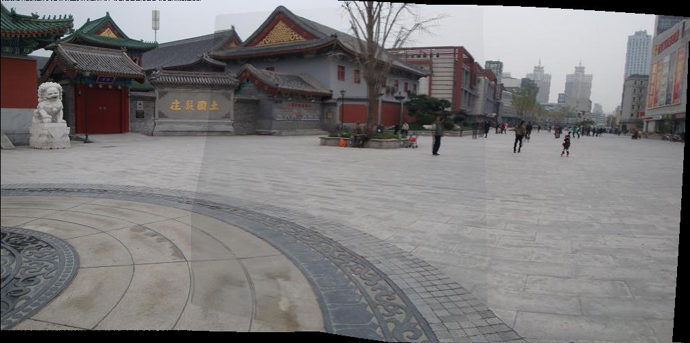
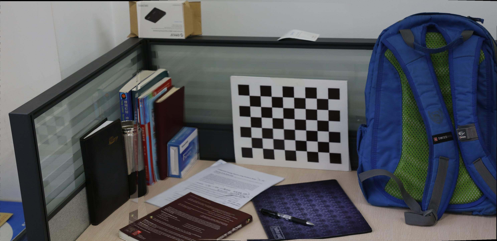

# Parallax-Tolerant Image Stitching Based on Robust Elastic Warping

This repository provides a **concise and readable implementation** of "Parallax-Tolerant Image Stitching Based on Robust Elastic Warping" (Li et al., TMM 2018).Currently only stitching of two images is implemented,please see the example entry file [RobustElasticWarping.md](./RobustElasticWarping.md) or [click here :eyes:](https://viewer.mathworks.com/?viewer=live_code&url=https%3A%2F%2Fwww.mathworks.com%2Fmatlabcentral%2Fmlc-downloads%2Fdownloads%2Ff5f6ae8b-81ed-459c-9f72-780550c75edd%2F1764236701%2Ffiles%2FRobustElasticWarping.mlx&embed=web).

:hugs: Happy Stitching!

## Requirements

- MATLAB® R2022b or later(Because Computer Vision Toolbox™ has [switched to the "Premultiply Convention"](https://www.mathworks.com/help/images/migrate-geometric-transformations-to-premultiply-convention.html) since R2022b.)
- Image Processing Toolbox™
- Computer Vision Toolbox™

## Results

|   datasets   |    global homography  |  Robust Elastic Warping(REW)   |Robust Elastic Warping(REW) With Similarity   |
| :-: | :-- |:-- |:-- |
|intersection |   |    |   |
|park |   |    |   |
|railtracks |   |    |   |
|worktable |   |    |   |

## References

[1] J. Li, Z. Wang, S. Lai, Y. Zhai and M. Zhang, "Parallax-Tolerant Image Stitching Based on Robust Elastic Warping," in IEEE Transactions on Multimedia, vol. 20, no. 7, pp. 1672-1687, July 2018, doi: 10.1109/TMM.2017.2777461.
