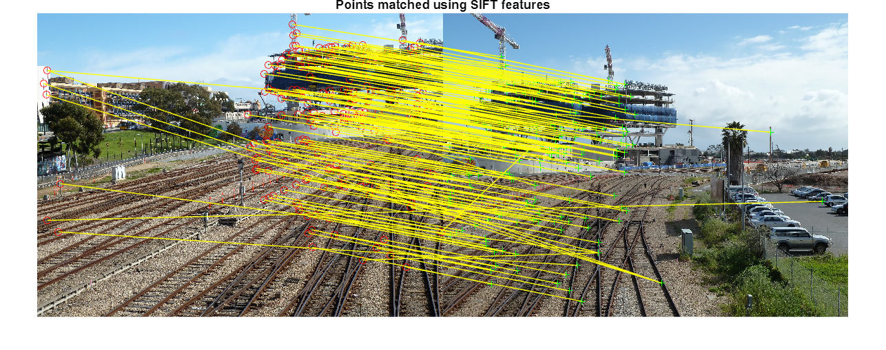
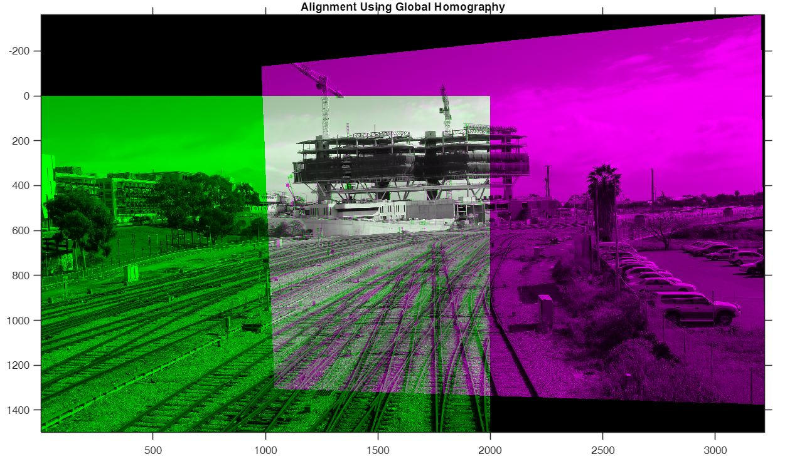
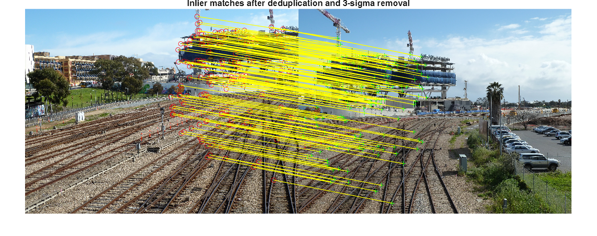
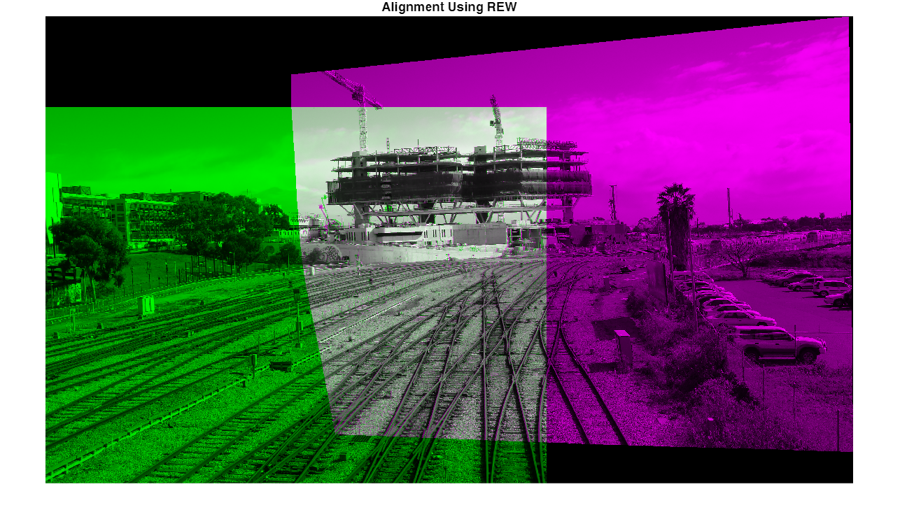
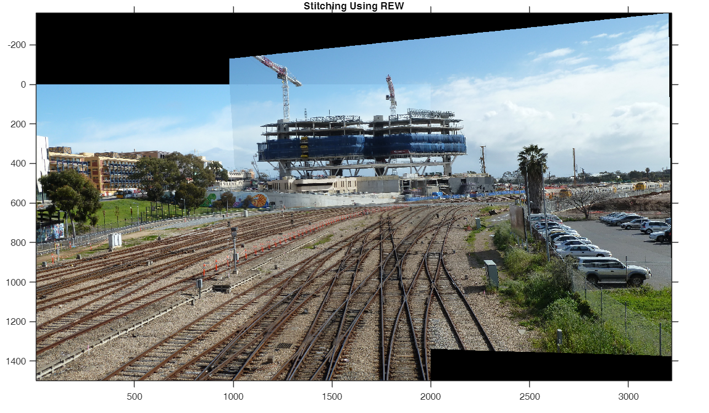
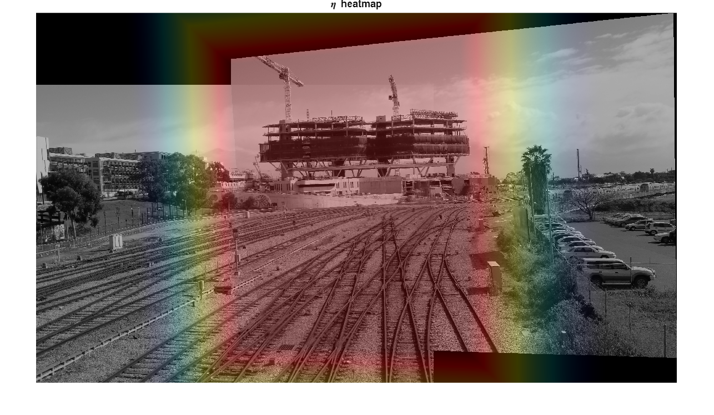
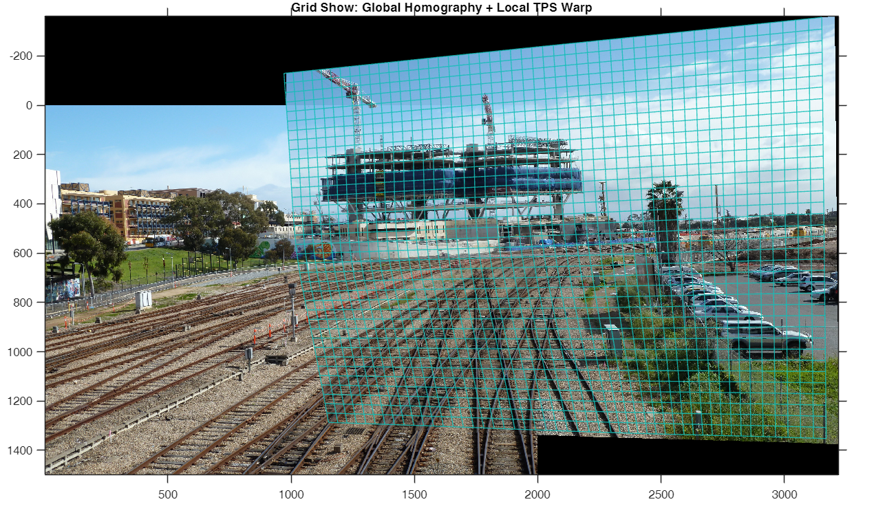
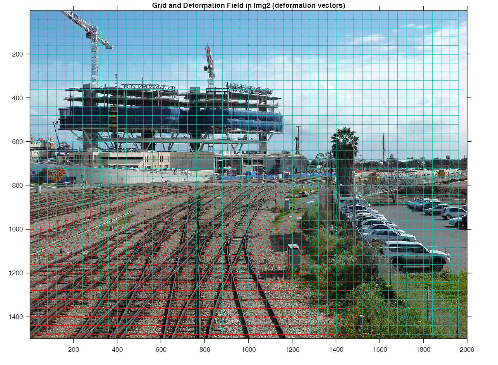

# Parallax\-Tolerant Image Stitching Based on Robust Elastic Warping

Author: 崔星星

Date: 2025.11

Email: [cuixingxing150@gmail.com](mailto:cuixingxing150@gmail.com)

> This example demonstrates the process and visualization of stitching two parallax\-tolerant Images. The global homography estimation is separated from the REW‑TPS algorithm to reduce algorithmic coupling.

## 1. Input images and basic setup

Change paths here if you want to run other image pairs. Provided images are under `two_views/` in this repo.

```matlab
img1 = imread("./two_views/railtracks/01.jpg"); % reference / fixed image
img2 = imread("./two_views/railtracks/02.jpg"); % moving image to be warped

% Convert to grayscale for feature detection 
gray1 = im2gray(img1);
gray2 = im2gray(img2);
```

## 2. Detect and match features (SIFT)

We detect a large set of SIFT keypoints and then sample them uniformly to avoid dense clustering in textured regions.

```matlab
numPoints = 5000;

% SIFT detection. Tune `EdgeThreshold` / `ContrastThreshold` if few points
% appear or too many noisy points appear.
points1 = detectSIFTFeatures(gray1, EdgeThreshold=500, ContrastThreshold=0);
points2 = detectSIFTFeatures(gray2, EdgeThreshold=500, ContrastThreshold=0);

% Uniformly sample points (helper function exists in MATLAB File Exchange
% or implemented in this repo). This reduces spatial bias.
points1 = selectUniform(points1, numPoints, size(gray1));
points2 = selectUniform(points2, numPoints, size(gray2));

% Extract descriptors and match them
[features1, validPoints1] = extractFeatures(gray1, points1);
[features2, validPoints2] = extractFeatures(gray2, points2);
indexPairs = matchFeatures(features1, features2);

% Collect matched point coordinates
matchedPoints1 = validPoints1(indexPairs(:, 1), :);
matchedPoints2 = validPoints2(indexPairs(:, 2), :);
matchedPoints1 = matchedPoints1.Location;
matchedPoints2 = matchedPoints2.Location;

% Visual check of matched points (montage view)
figure('Name','SIFT matches');
showMatchedFeatures(img1, img2, matchedPoints1, matchedPoints2, "montage");
title("Points matched using SIFT features")
```



## 3. Estimate global projective transform (homography)

We robustly estimate the fundamental matrix then derive a projective transform (homography) using the consistent inliers. This aligns the two images globally and provides a good initialization for the local REW step.

```matlab
[~, ok] = estimateFundamentalMatrix(matchedPoints1, matchedPoints2, Method="Norm8Point");
matchedPoints_ok1 = matchedPoints1(ok, :);
matchedPoints_ok2 = matchedPoints2(ok, :);

% Estimate a projective transform H such that points in img1 map to img2
tform = estgeotform2d(matchedPoints_ok1, matchedPoints_ok2, "projective");
```

## 4. Create panorama reference and warp by global homography

Create an output reference frame that covers both images after warping.

```matlab
tformInv = invert(tform);
xLimitsIn = [1, size(img2, 2)];
yLimitsIn = [1, size(img2, 1)];
[xLimitsOutInImg1, yLimitsOutInImg1] = outputLimits(tformInv, xLimitsIn, yLimitsIn);

xWorldLimits = [min(xLimitsOutInImg1(1), 1), max(xLimitsOutInImg1(2), size(img1, 2))];
yWorldLimits = [min(yLimitsOutInImg1(1), 1), max(yLimitsOutInImg1(2), size(img1, 1))];
panoWidth = ceil(diff(xWorldLimits));
panoHeight = ceil(diff(yWorldLimits));
panoRef = imref2d([panoHeight, panoWidth], xWorldLimits, yWorldLimits);

% Warp both images into the panorama reference (global homography alignment)
warpImg1 = imwarp(img1, rigidtform2d(), outputView=panoRef);
warpImg2 = imwarp(img2, tformInv, outputView=panoRef);
mask1 = imwarp(ones(size(img1, [1, 2])), rigidtform2d(), outputView=panoRef);
mask2 = imwarp(ones(size(img2, [1, 2])), tformInv, outputView=panoRef);

figure('Name','Global Homography Alignment');
imshowpair(warpImg1, panoRef, warpImg2, panoRef);
title("Alignment Using Global Homography")
```



## 5. Select control points and fit Robust Elastic Warp (REW)

We find unique overlapping matched points, transform them into the same coordinate frame and use them as control points for REW.

```matlab
[~, idx1] = unique(round(matchedPoints_ok1), 'rows', 'stable');
[~, idx2] = unique(round(matchedPoints_ok2), 'rows', 'stable');
idx = intersect(idx1, idx2);

fixedPtsInImg1 = matchedPoints_ok1(idx, :);      % fixed points (Img1 coords)
movingPtsInImg2 = matchedPoints_ok2(idx, :);     % corresponding points in Img2
fixedPtsInImg2 = transformPointsForward(tform, fixedPtsInImg1); % Img2 world coords

% Regularization parameter for REW (empirical). You may tune to control
% smoothness vs. data fidelity. Here scaled by image area.
lambda = 0.001 * prod(size(img1, [1, 2]));

% Fit REW: this constructs the warp object (obj) and selects inliers.
% The class `RewWarp` is part of this repo and implements the method from
% the paper. Inspect `RewWarp.m` for details.
obj = RewWarp(movingPtsInImg2, fixedPtsInImg2, lambda);
```

```matlabTextOutput
Warning: Matrix is close to singular or badly scaled. Results may be inaccurate. RCOND =  2.631495e-18.
Warning: Matrix is close to singular or badly scaled. Results may be inaccurate. RCOND =  3.949412e-18.
Warning: Matrix is close to singular or badly scaled. Results may be inaccurate. RCOND =  3.083879e-17.
Warning: Matrix is close to singular or badly scaled. Results may be inaccurate. RCOND =  3.133538e-17.
Warning: Matrix is close to singular or badly scaled. Results may be inaccurate. RCOND =  3.231064e-17.
Warning: Matrix is close to singular or badly scaled. Results may be inaccurate. RCOND =  3.301138e-17.
Warning: Matrix is close to singular or badly scaled. Results may be inaccurate. RCOND =  3.313663e-17.
Warning: Matrix is close to singular or badly scaled. Results may be inaccurate. RCOND =  3.330953e-17.
```

```matlab
figure('Name','Inliers After REW Fit');
showMatchedFeatures(img1, img2, fixedPtsInImg1(obj.inlierIdx, :), movingPtsInImg2(obj.inlierIdx, :), "montage");
title("Inlier matches after deduplication and 3-sigma removal")
```



## 6. Prepare meshgrid coordinates for local warping

The following maps coordinates between the panorama world and the moving image. We build a mesh to feed into the REW\-based warping function.

```matlab
u_im = xLimitsOutInImg1(1):xLimitsOutInImg1(2);
v_im = yLimitsOutInImg1(1):yLimitsOutInImg1(2);
[U, V] = meshgrid(u_im, v_im);
[u_im_, v_im_] = transformPointsForward(tform, U(:), V(:));

offset_x = round(xLimitsOutInImg1(1) - panoRef.XWorldLimits(1));
offset_y = round(yLimitsOutInImg1(1) - panoRef.YWorldLimits(1));

% Build full panorama grid in world coordinates and transform to image
[u, v] = meshgrid(xWorldLimits(1):xWorldLimits(2), yWorldLimits(1):yWorldLimits(2));
u = imresize(u, [panoHeight, panoWidth]);
v = imresize(v, [panoHeight, panoWidth]);
[u_, v_] = transformPointsForward(tform, u(:), v(:));

% Overlap region between images (used to limit where local warp applies)
[overlapLimitsU, overlapLimitsV] = outputLimits(tform, [1, size(img1, 2)], [1, size(img1, 1)]);

meshImg2_U = reshape(u_im_, size(U));
meshImg2_V = reshape(v_im_, size(V));
meshPano_U = reshape(u_, size(u));
meshPano_V = reshape(v_, size(v));

% Execute the local REW warp (warpImage is provided with the REW implementation)
[warped, gx, hy, eta] = warpImage(obj, img2, meshImg2_U, meshImg2_V, meshPano_U, meshPano_V, offset_x, offset_y, overlapLimitsU, overlapLimitsV);

figure('Name','REW Warp Result');
imshowpair(warpImg1, warped);
title("Alignment Using REW")
```



## 7. Blending to create final panorama

Create simple average blending in overlap region. For production, use [multi\-band](https://github.com/cuixing158/multiBandBlender) or seam\-finding blends for better artifacts handling.

```matlab
maskWarped = warped > 0;
maskWarped = maskWarped(:, :, 1);
maskOverlap = mask1 & maskWarped;
pano = (im2double(warpImg1) + im2double(warped)) ./ (im2double(maskOverlap) + 1);

figure('Name','Final Panorama');
imshow(pano, panoRef);
title("Stitching Using REW")
```



## 8. Visualization: heatmap and deformation grid

Visualize `eta` heatmap (shows where local deformation is strong)

```matlab
CAMshow(im2uint8(pano), eta)
title("\eta heatmap")
```



```matlab

% Visualize deformation grid on original and panorama coordinates
interval_Grid = 40; % grid sampling (pixels) used for visualization
[gridXInImg2, gridYInImg2] = meshgrid(1:interval_Grid:size(img2, 2), 1:interval_Grid:size(img2, 1));
[gridH, gridW] = size(gridXInImg2);
[gridXInWorld, gridYInWorld] = transformPointsInverse(tform, gridXInImg2(:), gridYInImg2(:));

[I, J] = worldToSubscript(panoRef, gridXInWorld, gridYInWorld);
deformXInImg2 = gridXInImg2(:) + diag(gx(I, J));
deformYInImg2 = gridYInImg2(:) + diag(hy(I, J));
[deformGridXInWorld, deformGridYInWorld] = transformPointsInverse(tform, deformXInImg2(:), deformYInImg2(:));

% Show grid on the global homography fused image
globalHomoFuse = (im2double(warpImg1) + im2double(warpImg2)) ./ (im2double(mask1 & mask2) + 1);
Gridshow(globalHomoFuse, gridXInWorld, gridYInWorld, gridH, gridW, panoRef);
title("Grid Show in Global Homography")
```


```matlab

% Show grid after adding local TPS-like deformation from REW
Gridshow(pano, deformGridXInWorld, deformGridYInWorld, gridH, gridW, panoRef);
title("Grid Show: Global Homography + Local TPS Warp")
```



```matlab
% Show deformation field overlayed on img2
Gridshow(img2, gridXInImg2, gridYInImg2, gridH, gridW, imref2d(size(img2)));
hold on;
quiver(gridXInImg2(:),gridYInImg2(:),diag(gx(I,J)),diag(hy(I,J)),'-r')
title("Grid and Deformation Field in Img2 (deformation vectors)")
```



## References

[1] J. Li, Z. Wang, S. Lai, Y. Zhai and M. Zhang, "Parallax\-Tolerant Image Stitching Based on Robust Elastic Warping," IEEE Transactions on Multimedia, vol. 20, no. 7, pp. 1672\-1687, July 2018.

## Support Functions (visual helpers)

These small helper functions display grids and heatmaps. They are kept at the end of the file for convenience so this script runs as a single file demo.

```matlab
function Gridshow(im, x, y, gridH, gridW, panoRef)
    figure; imshow(im, panoRef); hold on; axis on;
    gridXInImg1 = reshape(x, [gridH, gridW]);
    gridYInImg1 = reshape(y, [gridH, gridW]);
    mesh(gridXInImg1, gridYInImg1, zeros(gridH, gridW), 'FaceAlpha', 0, 'EdgeAlpha', 0.85)
end

function CAMshow(im, CAM, coff)
    arguments
        im {mustBeNumeric}
        CAM (:, :) double
        coff (1, 1) double = 2
    end

    imSize = size(im);
    CAM = imresize(CAM, imSize(1:2));
    CAM = normalizeImage(CAM);
    cmap = jet(255) .* linspace(0, 1, 255)';
    CAM = ind2rgb(uint8(CAM * 255), cmap) * 255;

    combinedImage = coff * double(rgb2gray(im)) + CAM;
    combinedImage = im2uint8(normalizeImage(combinedImage));
    figure; imshow(combinedImage);
end

function N = normalizeImage(I)
    minimum = min(I(:));
    maximum = max(I(:));
    N = (I - minimum) / (maximum - minimum);
end
```
